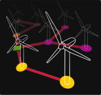

[](https://gitlab.windenergy.dtu.dk/TOPFARM/OptiWindNet/commits/main)
[](https://pypi.org/project/optiwindnet/)
[](https://gitlab.windenergy.dtu.dk/TOPFARM/OptiWindNet/blob/main/LICENSE)
[](https://gitlab.windenergy.dtu.dk/TOPFARM/OptiWindNet/commits/main)
<!---
[](https://zenodo.org/badge/latestdoi/164115313)
-->

{width=60%}

OptiWindNet
===========

Tool for designing and optimizing the electrical cable network of offshore wind farms.


|Documentation:<br>[optiwindnet.readthedocs.io][docs]||
|:--|:-:|
|<ul><li>[Quickstart][quick]</li><li>[Download the Jupyter notebooks][down] used in the documentation.</li><li>[Report an issue][issue] (at GitHub mirror)</li><li>[API Reference][api]</li><li>[How to Cite][cite]</li></ul>||

[docs]: https://optiwindnet.readthedocs.io
[quick]: https://optiwindnet.readthedocs.io/stable/notebooks/quickstart_high.html
[down]: https://gitlab.windenergy.dtu.dk/TOPFARM/OptiWindNet/-/tree/main/docs/notebooks
[issue]: https://github.com/DTUWindEnergy/OptiWindNet/issues
[api]: https://optiwindnet.readthedocs.io/stable/autoapi/index.html
[cite]: https://optiwindnet.readthedocs.io/stable/index.html#how-to-cite

Installation
------------

```
pip install optiwindnet
```

Detailed instructions in [Installation](https://optiwindnet.readthedocs.io/stable/setup.html#installation).

Requirements
------------

Python 3.10+. The use of a Python virtual environment is recommended. OptiWindNet's dependencies will be installed automatically when using `pip install optiwindnet`.

One may pre-install the dependencies in a python environment by using either:
- [requirements.txt](https://gitlab.windenergy.dtu.dk/TOPFARM/OptiWindNet/-/raw/main/requirements.txt?ref_type=heads&inline=false): `pip install -r requirements.txt`
- [environment.yml](https://gitlab.windenergy.dtu.dk/TOPFARM/OptiWindNet/-/raw/main/environment.yml?ref_type=heads&inline=false): `conda env create -f environment.yml` (name: *optiwindnet_env*)

Paper
-----

The methodology implemented in *OptiWindNet* is described in the peer-reviewed cientific article:
- Mauricio Souza de Alencar, Tuhfe Göçmen, Nicolaos A. Cutululis,
_Flexible cable routing framework for wind farm collection system optimization_,
European Journal of Operational Research,
2025, ISSN 0377-2217, <https://doi.org/10.1016/j.ejor.2025.07.069>.

```{code-block} bib
@article{
    SOUZADEALENCAR2025,
    title = {Flexible cable routing framework for wind farm collection system optimization},
    journal = {European Journal of Operational Research},
    year = {2025},
    issn = {0377-2217},
    doi = {https://doi.org/10.1016/j.ejor.2025.07.069},
    url = {https://www.sciencedirect.com/science/article/pii/S0377221725005946},
    author = {Mauricio {Souza de Alencar} and Tuhfe Göçmen and Nicolaos A. Cutululis},
    keywords = {Combinatorial optimization, Network design, Collection system, Wind farm},
}
```

Acknowledgements
----------------

The heuristics implemented in this repository (release 0.0.1) are presented and analyzed in the MSc thesis [Optimization heuristics for offshore wind power plant collection systems design](https://fulltext-gateway.cvt.dk/oafilestore?oid=62dddf809a5e7116caf943f3&targetid=62dddf80a41ba354e4ed35bc) (DTU Wind - Technical University of Denmark, July 4, 2022)

The meta-heuristic used is [vidalt/HGS-CVRP: Modern implementation of the hybrid genetic search (HGS) algorithm specialized to the capacitated vehicle routing problem (CVRP). This code also includes an additional neighborhood called SWAP\*.](https://github.com/vidalt/HGS-CVRP) via its Python bindings [chkwon/PyHygese: A Python wrapper for the Hybrid Genetic Search algorithm for Capacitated Vehicle Routing Problems (HGS-CVRP)](https://github.com/chkwon/PyHygese).

The cable routing relies on a navigation mesh generated by the library [artem-ogre/CDT: Constrained Delaunay Triangulation (C++)](https://github.com/artem-ogre/CDT) via its Python bindings - [artem-ogre/PythonCDT: Constrained Delaunay Triangulation (Python)](https://github.com/artem-ogre/PythonCDT).
